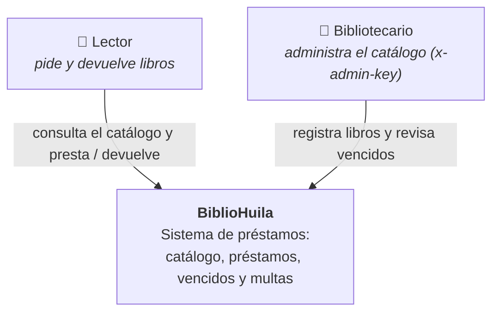

# C4 nivel 1 · Contexto

Quién usa BiblioHuila y con qué sistemas externos habla. No hay integraciones externas
(ni pagos ni autenticación de terceros): las multas se cobran en ventanilla.

```mermaid
flowchart TB
    lector["👤 Lector<br/><i>pide y devuelve libros</i>"]
    biblio["👤 Bibliotecario<br/><i>administra el catálogo (x-admin-key)</i>"]
    sistema["<b>BiblioHuila</b><br/>Sistema de préstamos:<br/>catálogo, préstamos, vencidos y multas"]
    lector -->|consulta el catálogo y presta / devuelve| sistema
    biblio -->|registra libros y revisa vencidos| sistema
```
