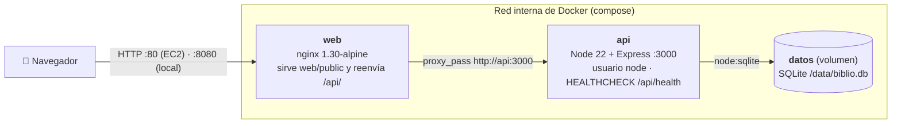

# C4 nivel 2 · Contenedores

Dos contenedores y un volumen. Solo `web` se publica; `api` vive en la red interna de Docker.

```mermaid
flowchart LR
    U["👤 Navegador"] -->|"HTTP :80 (EC2) · :8080 (local)"| WEB
    subgraph docker["Red interna de Docker (compose)"]
        WEB["<b>web</b><br/>nginx 1.30-alpine<br/>sirve web/public y reenvía /api/"]
        API["<b>api</b><br/>Node 22 + Express :3000<br/>usuario node · HEALTHCHECK /api/health"]
        DB[("<b>datos</b> (volumen)<br/>SQLite /data/biblio.db")]
        WEB -->|"proxy_pass http://api:3000"| API
        API -->|node:sqlite| DB
    end
```
