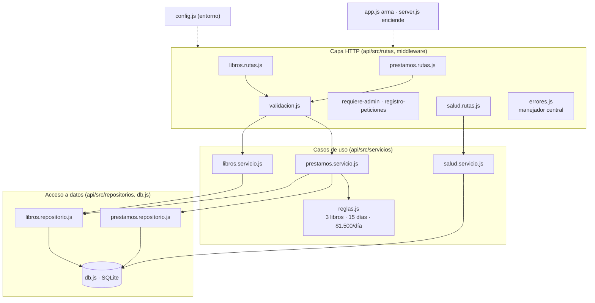

# C4 nivel 3 · Componentes de la API

Cada capa conoce solo a la de abajo. Las reglas de la biblioteca no saben de HTTP ni de SQL,
por eso se prueban en milisegundos (`api/test/reglas.test.js`).

```mermaid
flowchart TB
    subgraph http["Capa HTTP (api/src/rutas, middleware)"]
        R1["libros.rutas.js"]
        R2["prestamos.rutas.js"]
        R3["salud.rutas.js"]
        MW["requiere-admin · registro-peticiones"]
        VAL["validacion.js"]
        ERR["errores.js<br/>manejador central"]
    end
    subgraph neg["Casos de uso (api/src/servicios)"]
        S1["libros.servicio.js"]
        S2["prestamos.servicio.js"]
        RG["reglas.js<br/>3 libros · 15 días · $1.500/día"]
        S3["salud.servicio.js"]
    end
    subgraph datos["Acceso a datos (api/src/repositorios, db.js)"]
        P1["libros.repositorio.js"]
        P2["prestamos.repositorio.js"]
        DB[("db.js · SQLite")]
    end
    R1 --> VAL --> S1
    R2 --> VAL
    VAL --> S2
    R3 --> S3
    S2 --> RG
    S1 --> P1
    S2 --> P1 & P2
    P1 & P2 & S3 --> DB
    CFG["config.js (entorno)"] -.-> http
    APP["app.js arma · server.js enciende"] -.-> http
```
